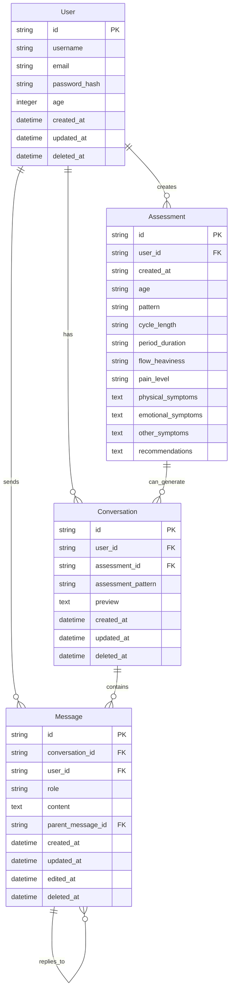

# Entity-Relationship Diagram (ERD) for Dottie

## Overview

This document outlines the database structure for the Dottie Menstrual Health Assessment application. This simplified structure is designed for an MVP implementation by junior developers.

## Entities and Relationships

### Entity Diagram



## Entity Descriptions

### User
- **id**: Unique identifier for the user (UUID)
- **username**: User's chosen username (unique)
- **email**: User's email address (unique, for account management)
- **password_hash**: Hashed password for authentication
- **age**: User's age (integer)
- **created_at**: When the user account was created
- **updated_at**: When the user account was last updated
- **deleted_at**: Soft delete timestamp (nullable)

### Assessment
- **id**: Unique identifier for each assessment (string)
- **user_id**: Reference to the user taking the assessment
- **created_at**: Timestamp when assessment was created (string format)
- **age**: Age at time of assessment
- **pattern**: Menstrual pattern classification
- **cycle_length**: Length of menstrual cycle
- **period_duration**: Duration of menstrual period
- **flow_heaviness**: Level of menstrual flow intensity
- **pain_level**: Level of pain experienced
- **physical_symptoms**: Physical symptoms experienced (text/JSON)
- **emotional_symptoms**: Emotional symptoms experienced (text/JSON)
- **other_symptoms**: Additional symptoms not categorized above (text/JSON)
- **recommendations**: Generated recommendations based on assessment (text/JSON)

### Symptom
- **id**: Unique identifier for each symptom entry (auto-increment)
- **assessment_id**: Reference to the assessment this symptom belongs to
- **symptom_name**: Name/description of the symptom
- **symptom_type**: Type of symptom (physical, emotional, etc.)

### Conversation
- **id**: Unique identifier for each conversation (UUID)
- **user_id**: Reference to the user who owns the conversation
- **assessment_id**: Optional reference to related assessment (nullable)
- **assessment_pattern**: Pattern associated with the conversation topic
- **preview**: Preview text of the most recent message
- **created_at**: When the conversation was created
- **updated_at**: When the conversation was last updated
- **deleted_at**: Soft delete timestamp (nullable)

### Message
- **id**: Unique identifier for each message (UUID)
- **conversation_id**: Reference to the conversation this message belongs to
- **user_id**: Reference to the user (for tracking user vs system messages)
- **role**: The sender role (user, assistant, system)
- **content**: The message content
- **parent_message_id**: Reference to parent message for threading (nullable)
- **created_at**: When the message was sent
- **updated_at**: When the message was last updated
- **edited_at**: When the message was edited (nullable)
- **deleted_at**: Soft delete timestamp (nullable)

## Relationships

1. **User to Assessment**: One-to-Many (A user can have multiple assessments)
2. **User to Conversation**: One-to-Many (A user can have multiple conversations)
3. **User to Message**: One-to-Many (A user can send multiple messages)
4. **Assessment to Symptom**: One-to-Many (An assessment can have multiple symptoms)
5. **Assessment to Conversation**: One-to-Many (An assessment can generate multiple conversations)
6. **Conversation to Message**: One-to-Many (A conversation contains multiple messages)
7. **Message to Message**: One-to-Many (Messages can be threaded/replies)

## Static Data (Not in Database)

### Questions
The question data will be stored as static content in the application code rather than in the database:

```javascript
const questions = [
  {
    id: 1,
    text: "What is your age group?",
    orderNumber: 1,
    questionType: "single_choice",
    options: ["under_12", "12_14", "15_17", "18_24", "over_24"]
  },
  {
    id: 2,
    text: "What is your menstrual cycle length?",
    orderNumber: 2,
    questionType: "single_choice",
    options: ["less_than_21", "21_25", "26_30", "31_35", "more_than_35", "irregular"]
  },
  // Other questions defined statically
]
```

## Key Changes Since Last Update

### 1. Enhanced User Model
- Added `deleted_at` field for soft delete functionality
- Standardized timestamp fields

### 2. Restructured Assessment Model
- Changed from simple assessment + separate symptoms table to comprehensive assessment structure
- Added detailed tracking fields: pattern, cycle_length, period_duration, flow_heaviness, pain_level
- Separated symptoms into physical/emotional/other categories
- Integrated recommendations directly into assessment record
- Uses string IDs for better test compatibility

### 3. Enhanced Chat System
- Added assessment integration to conversations via `assessment_id` and `assessment_pattern`
- Added `preview` field for better UX
- Enhanced message threading with `parent_message_id`
- Added `user_id` to messages for better tracking
- Implemented soft deletes across chat entities
- Added message editing functionality with `edited_at`

### 4. Removed Legacy Tables
- Eliminated separate `period_logs` table (functionality consolidated into assessments)
- Simplified symptoms tracking through direct assessment relationship

## MVP Implementation Phases

### Phase 1 (Core MVP) ✅
- User signup/login with authentication
- Comprehensive assessment flow with detailed tracking
- Assessment-based recommendations
- Basic chat functionality with conversation management

### Phase 2 (Enhanced Features) 🔄
- Assessment-conversation integration for contextual chat
- Advanced symptom tracking and pattern recognition
- Medical journal reference comparison
- Improved analytics and visualizations

### Phase 3 (Advanced Features) 📋
- Azure ML integration for personalized feedback
- Enhanced AI chat with assessment context
- Advanced pattern analysis and predictions
- Export and reporting capabilities

## Database Implementation Notes

This will use cosmos db in the Azure cloud. Locally, it will run on sqlite.

### Soft Delete Implementation
The application implements soft deletes for User, Conversation, and Message entities using `deleted_at` timestamps. This allows for data recovery and maintains referential integrity while providing delete functionality.

### Assessment Data Structure
Assessments now store comprehensive menstrual health data in a denormalized structure for efficient querying and analysis. Symptoms are tracked both within the assessment record and through the separate symptoms table for different use cases.

### Chat-Assessment Integration
Conversations can be linked to specific assessments, enabling contextual AI conversations about specific health patterns and concerns.
