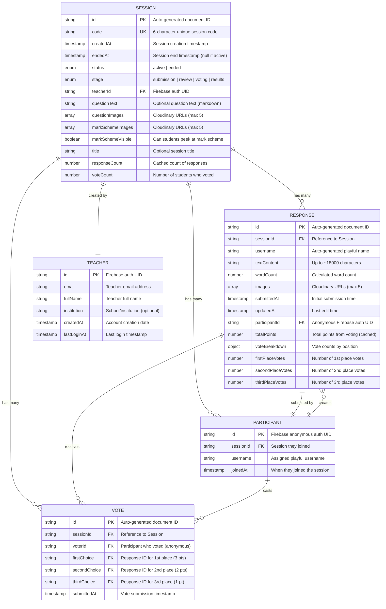

# Entity Relationship Diagram (ERD)

## Mermaid ERD



---

## Detailed Entity Descriptions

### SESSION Entity

**Purpose:** Represents a live exam question session created by a teacher.

**Attributes:**
- `id` (PK): Auto-generated Firestore document ID
- `code` (UK): Unique 6-character alphanumeric code for students to join
- `createdAt`: Timestamp when session was created
- `endedAt`: Timestamp when session ended (null if still active)
- `status`: Session status - "active" or "ended"
- `stage`: Current workflow stage - "submission", "review", "voting", or "results"
- `teacherId` (FK): References TEACHER.id
- `questionText`: Optional text-based question (supports markdown)
- `questionImages`: Array of Cloudinary URLs (0-5 images)
- `markSchemeImages`: Array of Cloudinary URLs (0-5 images)
- `markSchemeVisible`: Boolean - whether students can peek at mark scheme
- `title`: Optional session title for organization
- `responseCount`: Cached count for performance
- `voteCount`: Number of participants who have voted

**Relationships:**
- One SESSION has many RESPONSES (1:N)
- One SESSION has many VOTES (1:N)
- One SESSION has many PARTICIPANTS (1:N)
- One SESSION belongs to one TEACHER (N:1)

**Indexes:**
- Index on `code` for quick session lookup
- Index on `teacherId` for teacher's session list
- Index on `status` and `createdAt` for cleanup jobs

---

### RESPONSE Entity

**Purpose:** Stores student responses to exam questions.

**Attributes:**
- `id` (PK): Auto-generated Firestore document ID
- `sessionId` (FK): References SESSION.id
- `username`: Auto-generated playful username (e.g., "Dancing Penguin 42")
- `textContent`: Student's written response (up to ~18,000 characters)
- `wordCount`: Calculated word count
- `images`: Array of Cloudinary URLs (0-5 images)
- `submittedAt`: Initial submission timestamp
- `updatedAt`: Last modification timestamp
- `participantId` (FK): References PARTICIPANT.id
- `totalPoints`: Cached total points from all votes
- `voteBreakdown`: Object containing vote counts
  - `firstPlaceVotes`: Number of 1st place votes received (×3 pts each)
  - `secondPlaceVotes`: Number of 2nd place votes received (×2 pts each)
  - `thirdPlaceVotes`: Number of 3rd place votes received (×1 pt each)

**Relationships:**
- Many RESPONSES belong to one SESSION (N:1)
- One RESPONSE receives many VOTES (1:N)
- One RESPONSE is submitted by one PARTICIPANT (N:1)

**Indexes:**
- Index on `sessionId` for fetching all responses in a session
- Index on `participantId` for finding user's response
- Index on `totalPoints` (descending) for leaderboard sorting
- Compound index on `sessionId` + `totalPoints` for efficient ranking

---

### VOTE Entity

**Purpose:** Records student votes for their top 3 favorite responses.

**Attributes:**
- `id` (PK): Auto-generated Firestore document ID
- `sessionId` (FK): References SESSION.id
- `voterId` (FK): Participant who cast the vote (references PARTICIPANT.id)
- `firstChoice` (FK): Response ID ranked 1st place (3 points)
- `secondChoice` (FK): Response ID ranked 2nd place (2 points)
- `thirdChoice` (FK): Response ID ranked 3rd place (1 point)
- `submittedAt`: Vote submission timestamp

**Relationships:**
- Many VOTES belong to one SESSION (N:1)
- Many VOTES reference many RESPONSES (N:M through firstChoice, secondChoice, thirdChoice)
- One VOTE is cast by one PARTICIPANT (N:1)

**Indexes:**
- Index on `sessionId` for fetching all votes
- Index on `voterId` for checking if user voted
- Compound index on `sessionId` + `voterId` for quick vote lookup

**Constraints:**
- `firstChoice`, `secondChoice`, and `thirdChoice` must all be different
- Cannot vote for own response (enforced in application logic)
- Each participant can only vote once per session

---

### PARTICIPANT Entity

**Purpose:** Temporary record of a student participating in a session.

**Attributes:**
- `id` (PK): Firebase anonymous authentication UID
- `sessionId` (FK): References SESSION.id
- `username`: Auto-generated playful username assigned upon joining
- `joinedAt`: Timestamp when participant joined the session

**Relationships:**
- Many PARTICIPANTS belong to one SESSION (N:1)
- One PARTICIPANT can create one RESPONSE (1:1 per session)
- One PARTICIPANT can cast one VOTE (1:1 per session)

**Lifecycle:**
- Created when student joins session
- Deleted during session cleanup (24 hours after session ends)
- Uses Firebase Anonymous Auth for temporary authentication

**Indexes:**
- Index on `sessionId` for participant count
- Compound index on `sessionId` + `username` for uniqueness check

---

### TEACHER Entity

**Purpose:** Represents a teacher/instructor account.

**Attributes:**
- `id` (PK): Firebase authentication UID
- `email`: Teacher's email address (unique)
- `fullName`: Teacher's full name
- `institution`: School or institution name (optional)
- `createdAt`: Account creation timestamp
- `lastLoginAt`: Last login timestamp

**Relationships:**
- One TEACHER creates many SESSIONS (1:N)

**Authentication:**
- Uses Firebase Authentication (email/password or OAuth)
- Persistent account (not anonymous)

**Indexes:**
- Index on `email` for login lookup
- Index on `createdAt` for analytics

---

## Relationship Details

### SESSION ↔ RESPONSE (1:N)

- **Cardinality:** One session can have many responses (0 to unlimited)
- **Foreign Key:** `RESPONSE.sessionId` → `SESSION.id`
- **Cascade:** When session is deleted, all responses are deleted
- **Business Rules:**
  - Responses can only be created during "submission" stage
  - Responses are locked (read-only) after "review" stage starts
  - Each participant can submit only one response per session

### SESSION ↔ VOTE (1:N)

- **Cardinality:** One session can have many votes (0 to N participants × 3 rankings)
- **Foreign Key:** `VOTE.sessionId` → `SESSION.id`
- **Cascade:** When session is deleted, all votes are deleted
- **Business Rules:**
  - Votes can only be cast during "voting" stage
  - Each participant casts one vote with three rankings
  - Votes are locked after "results" stage starts

### SESSION ↔ PARTICIPANT (1:N)

- **Cardinality:** One session can have many participants (0 to unlimited)
- **Foreign Key:** `PARTICIPANT.sessionId` → `SESSION.id`
- **Cascade:** When session is deleted, all participants are deleted
- **Business Rules:**
  - Participants can join during "submission" stage
  - Username must be unique within session
  - Anonymous authentication used

### TEACHER ↔ SESSION (1:N)

- **Cardinality:** One teacher can create many sessions
- **Foreign Key:** `SESSION.teacherId` → `TEACHER.id`
- **Cascade:** When teacher is deleted, sessions can be retained or deleted (policy decision)
- **Business Rules:**
  - Only the creating teacher can modify session
  - Teachers can view all their past sessions

### PARTICIPANT ↔ RESPONSE (1:1 per session)

- **Cardinality:** One participant submits one response per session
- **Foreign Key:** `RESPONSE.participantId` → `PARTICIPANT.id`
- **Cascade:** When participant is deleted, response is deleted
- **Business Rules:**
  - Cannot submit multiple responses
  - Must be in "submission" stage
  - Can edit until "review" stage starts

### PARTICIPANT ↔ VOTE (1:1 per session)

- **Cardinality:** One participant casts one vote (with 3 rankings) per session
- **Foreign Key:** `VOTE.voterId` → `PARTICIPANT.id`
- **Cascade:** When participant is deleted, vote is deleted
- **Business Rules:**
  - Must be in "voting" stage
  - Cannot vote for own response
  - Must rank exactly 3 different responses

### RESPONSE ↔ VOTE (1:N)

- **Cardinality:** One response can receive many votes
- **Foreign Keys:**
  - `VOTE.firstChoice` → `RESPONSE.id`
  - `VOTE.secondChoice` → `RESPONSE.id`
  - `VOTE.thirdChoice` → `RESPONSE.id`
- **Business Rules:**
  - Points calculated: 1st=3pts, 2nd=2pts, 3rd=1pt
  - Total points cached in `RESPONSE.totalPoints`
  - Vote breakdown tracked for transparency

---

## Data Integrity Rules

### Referential Integrity

1. **Session Deletion:** Cascades to all related RESPONSES, VOTES, and PARTICIPANTS
2. **Participant Deletion:** Cascades to their RESPONSE and VOTE
3. **Teacher Deletion:** Policy-based (retain or cascade to SESSIONS)

### Business Constraints

1. **Vote Uniqueness:**
   - A participant can vote only once per session
   - The three vote choices must all be different responses
   - Cannot vote for own response

2. **Response Uniqueness:**
   - A participant can submit only one response per session
   - Response must have either text or images (cannot be empty)

3. **Stage Progression:**
   - Stages must progress in order: submission → review → voting → results
   - Cannot go backwards in stages
   - Actions locked based on current stage

4. **Session Code Uniqueness:**
   - Each active session must have a unique 6-character code
   - Codes can be reused after session cleanup

### Data Validation

1. **Text Content:** Max ~18,000 characters (3000 words)
2. **Images:** Max 5 per response/question/mark scheme
3. **Image Size:** Max 10MB per image
4. **Username:** Auto-generated, must be unique within session
5. **Session Code:** 6 alphanumeric characters, case-insensitive

---

## Firestore Collection Structure

```
/sessions/{sessionId}
  - Session document fields

/sessions/{sessionId}/responses/{responseId}
  - Response subcollection

/sessions/{sessionId}/votes/{voteId}
  - Vote subcollection

/sessions/{sessionId}/participants/{participantId}
  - Participant subcollection

/teachers/{teacherId}
  - Teacher document fields
```

**Benefits of this structure:**
- Efficient queries within a session
- Automatic cleanup of related data
- Real-time listeners on subcollections
- Security rules scoped to session level

---

## Indexes Required

### Firestore Composite Indexes

```javascript
// For leaderboard (responses sorted by points)
sessions/{sessionId}/responses
  sessionId ASC, totalPoints DESC

// For finding user's vote
sessions/{sessionId}/votes
  sessionId ASC, voterId ASC

// For cleanup jobs
sessions
  status ASC, endedAt ASC

// For teacher's sessions list
sessions
  teacherId ASC, createdAt DESC
```

---

## Caching Strategy

### Cached Fields (Denormalized)

1. **SESSION.responseCount:** Cache count instead of querying subcollection
2. **SESSION.voteCount:** Cache count instead of counting votes
3. **RESPONSE.totalPoints:** Calculate from votes and cache
4. **RESPONSE.voteBreakdown:** Cache vote counts for transparency

### Cache Invalidation

- Update counts when responses/votes are added
- Recalculate points when votes change
- Use Firestore transactions for atomic updates

---

## Cleanup and Data Retention

### Automated Cleanup (Nightly Job)

```javascript
// Pseudo-code for cleanup
function cleanupOldSessions() {
  const cutoffTime = now() - 24_hours;
  const oldSessions = query(
    sessions,
    where("status", "==", "ended"),
    where("endedAt", "<", cutoffTime)
  );

  for (const session of oldSessions) {
    // Delete Cloudinary images
    deleteImages(session.questionImages);
    deleteImages(session.markSchemeImages);

    // Delete response images
    for (const response of session.responses) {
      deleteImages(response.images);
    }

    // Delete session (cascades to subcollections)
    deleteSession(session.id);
  }
}
```

### Data Deleted

- Session documents
- All responses (including images)
- All votes
- All participants
- Question and mark scheme images

### Data Retained

- Teacher accounts
- Session metadata (optional for analytics)
