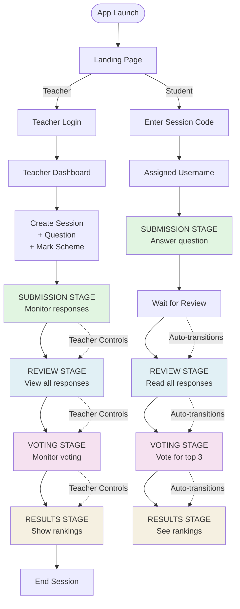
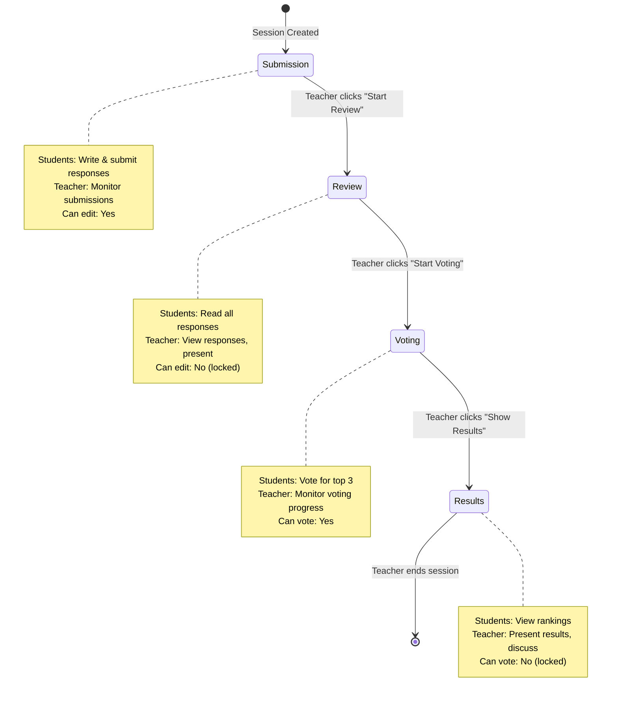
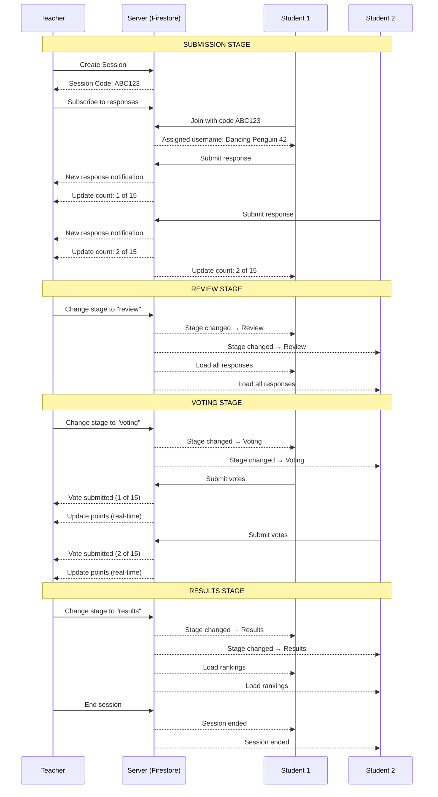
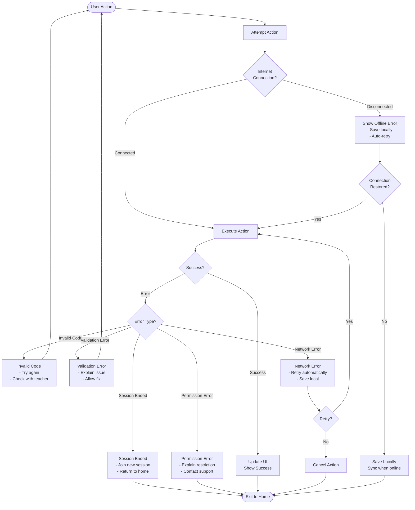

# User Flow Charts

## Teacher Flow

```mermaid
flowchart TD
    Start([Teacher Opens App]) --> Landing[Landing Page]
    Landing --> Login[Teacher Login/Register]
    Login --> Auth{Authentication}
    Auth -->|Success| Dashboard[Teacher Dashboard]
    Auth -->|Failure| Login

    Dashboard --> CreateSession[Click Create New Session]
    CreateSession --> SetQuestion[Set Question Form]
    SetQuestion --> AddQuestionText{Add Question Text?}
    AddQuestionText -->|Yes| QuestionText[Enter Question Text]
    AddQuestionText -->|No| AddQuestionImages
    QuestionText --> AddQuestionImages{Add Question Images?}
    AddQuestionImages -->|Yes| UploadQImages[Upload Question Images<br/>Max 5]
    AddQuestionImages -->|No| AddMarkScheme
    UploadQImages --> AddMarkScheme{Add Mark Scheme?}

    AddMarkScheme -->|Yes| UploadMarkScheme[Upload Mark Scheme Images<br/>Max 5]
    AddMarkScheme -->|No| SessionSettings
    UploadMarkScheme --> SessionSettings[Configure Settings<br/>- Allow mark scheme peek<br/>- Enable voting<br/>- Enable peer marking]

    SessionSettings --> CreateBtn[Click Create Session]
    CreateBtn --> SessionCreated[Session Created<br/>Code Generated]
    SessionCreated --> SessionDashboard[Session Dashboard]

    SessionDashboard --> SubmissionStage[SUBMISSION STAGE]
    SubmissionStage --> MonitorResponses[Monitor Responses<br/>Real-time Updates]
    MonitorResponses --> CheckResponses{Enough Responses?}
    CheckResponses -->|No| MonitorResponses
    CheckResponses -->|Yes| StartReview[Click Start Review]

    StartReview --> ReviewStage[REVIEW STAGE]
    ReviewStage --> ViewAllResponses[View All Responses<br/>- List/Grid View<br/>- Search/Filter<br/>- Export Options]
    ViewAllResponses --> PresentMode{Enter Presentation Mode?}
    PresentMode -->|Yes| BoardView[Board Presentation<br/>- Navigate responses<br/>- Toggle mark scheme<br/>- Full-screen mode]
    PresentMode -->|No| ReadyForVoting
    BoardView --> ReadyForVoting{Ready for Voting?}
    ReadyForVoting -->|No| ViewAllResponses
    ReadyForVoting -->|Yes| StartVoting[Click Start Voting]

    StartVoting --> VotingStage[VOTING STAGE]
    VotingStage --> MonitorVotes[Monitor Voting Progress<br/>- Live point tracker<br/>- Vote count<br/>- Real-time updates]
    MonitorVotes --> CheckVotes{All Voted?}
    CheckVotes -->|No| MonitorVotes
    CheckVotes -->|Yes| ShowResults[Click Show Results]

    ShowResults --> ResultsStage[RESULTS STAGE]
    ResultsStage --> ViewRankings[View Final Rankings<br/>- Leaderboard<br/>- Point breakdown<br/>- Vote details]
    ViewRankings --> PresentResults{Present Results?}
    PresentResults -->|Yes| ResultsPresentation[Results Presentation<br/>- Podium view<br/>- Navigate responses<br/>- Discussion mode]
    PresentResults -->|No| SessionActions
    ResultsPresentation --> SessionActions[Session Actions]

    SessionActions --> EndSession{End Session?}
    EndSession -->|Yes| SessionEnded[Session Ended<br/>Auto-cleanup scheduled]
    EndSession -->|No| ViewRankings
    SessionEnded --> Dashboard

    Dashboard --> ViewPastSessions[View Past Sessions]
    ViewPastSessions --> Dashboard

    style SubmissionStage fill:#e1f5e1
    style ReviewStage fill:#e1f0f5
    style VotingStage fill:#f5e1f0
    style ResultsStage fill:#f5f0e1
```

---

## Student Flow

```mermaid
flowchart TD
    Start([Student Opens App]) --> Landing[Landing Page]
    Landing --> JoinSession[Click Join Session]
    JoinSession --> EnterCode[Enter 6-Character<br/>Session Code]
    EnterCode --> ValidateCode{Valid Code?}

    ValidateCode -->|Invalid| ErrorInvalid[Error: Session Not Found]
    ValidateCode -->|Ended| ErrorEnded[Error: Session Ended]
    ValidateCode -->|Valid| JoinSuccess[Join Success]
    ErrorInvalid --> EnterCode
    ErrorEnded --> EnterCode

    JoinSuccess --> AssignUsername[Auto-Assigned<br/>Playful Username<br/>e.g., Dancing Penguin 42]
    AssignUsername --> CheckStage{Check<br/>Session Stage}

    CheckStage -->|Submission| QuestionView[View Question Page]
    CheckStage -->|Review| ReviewView[View All Responses]
    CheckStage -->|Voting| VotingView[Voting Page]
    CheckStage -->|Results| ResultsView[Results Page]

    %% Submission Stage Flow
    QuestionView --> ViewQuestion[View Question<br/>- Text<br/>- Images<br/>- Mark Scheme peek]
    ViewQuestion --> StartTyping[Start Writing Response]
    StartTyping --> DraftSaved[Auto-Save Draft<br/>Every 5 seconds]
    DraftSaved --> AddImages{Add Images?}
    AddImages -->|Yes| UploadImages[Upload Images<br/>Max 5, 10MB each]
    AddImages -->|No| ReviewResponse
    UploadImages --> ReviewResponse[Review Response]

    ReviewResponse --> ReadySubmit{Ready to Submit?}
    ReadySubmit -->|No| StartTyping
    ReadySubmit -->|Yes| SubmitResponse[Click Submit Response]
    SubmitResponse --> ConfirmSubmit[Confirmation Modal]
    ConfirmSubmit --> Submitted[Response Submitted]

    Submitted --> WaitingView[Waiting View<br/>- Progress indicator<br/>- Can still edit]
    WaitingView --> CanEdit{Edit Response?}
    CanEdit -->|Yes| StartTyping
    CanEdit -->|No| WaitForReview{Review<br/>Stage Starts?}
    WaitForReview -->|No| WaitingView
    WaitForReview -->|Yes| ResponseLocked[Response Locked]

    %% Review Stage Flow
    ResponseLocked --> ReviewView
    ReviewView --> BrowseResponses[Browse All Responses<br/>- Expand/Collapse<br/>- View images<br/>- Search/Filter]
    BrowseResponses --> ReadResponse{Read Response?}
    ReadResponse -->|Yes| ExpandResponse[Expand Response<br/>- Full text<br/>- All images<br/>- Mark scheme]
    ReadResponse -->|No| BrowseResponses
    ExpandResponse --> ViewImage{View Image?}
    ViewImage -->|Yes| ImageLightbox[Image Lightbox<br/>- Zoom<br/>- Navigate<br/>- Download]
    ViewImage -->|No| BrowseResponses
    ImageLightbox --> BrowseResponses

    BrowseResponses --> WaitForVoting{Voting<br/>Stage Starts?}
    WaitForVoting -->|No| BrowseResponses
    WaitForVoting -->|Yes| VotingView

    %% Voting Stage Flow
    VotingView --> SeeVotingInstructions[See Voting Instructions<br/>- Rank top 3<br/>- Cannot vote own<br/>- Points: 3/2/1]
    SeeVotingInstructions --> SelectFirst[Select 1st Place<br/>3 points]
    SelectFirst --> SelectSecond[Select 2nd Place<br/>2 points]
    SelectSecond --> SelectThird[Select 3rd Place<br/>1 point]

    SelectThird --> ReviewVotes[Review Selections]
    ReviewVotes --> ChangeVotes{Change Votes?}
    ChangeVotes -->|Yes| SelectFirst
    ChangeVotes -->|No| SubmitVotes[Click Submit Votes]

    SubmitVotes --> ConfirmVotes[Confirmation Modal<br/>- Review all votes<br/>- Cannot change after]
    ConfirmVotes --> ConfirmSubmitVotes{Confirm?}
    ConfirmSubmitVotes -->|No| ReviewVotes
    ConfirmSubmitVotes -->|Yes| VotesSubmitted[Votes Submitted]

    VotesSubmitted --> WaitForResults[Waiting for Results<br/>- Show your votes<br/>- Loading animation]
    WaitForResults --> ResultsReady{Results<br/>Stage Starts?}
    ResultsReady -->|No| WaitForResults
    ResultsReady -->|Yes| ResultsView

    %% Results Stage Flow
    ResultsView --> SeeRankings[See Final Rankings<br/>- Top 3 podium<br/>- All responses ranked<br/>- Point totals<br/>- Vote breakdown]
    SeeRankings --> CheckOwnRank[Check Your Response<br/>- Your ranking<br/>- Points received<br/>- Who voted for you]
    CheckOwnRank --> CheckYourVotes[Check Your Votes<br/>- Did your picks win?]
    CheckYourVotes --> ExploreResults[Explore Results<br/>- View all responses<br/>- See vote details]

    ExploreResults --> SessionEnds{Session<br/>Ends?}
    SessionEnds -->|Yes| SessionEndedView[Session Ended<br/>Thank You Message]
    SessionEnds -->|No| ExploreResults

    SessionEndedView --> JoinNew{Join<br/>New Session?}
    JoinNew -->|Yes| EnterCode
    JoinNew -->|No| End([Exit])

    style QuestionView fill:#e1f5e1
    style WaitingView fill:#e1f5e1
    style ReviewView fill:#e1f0f5
    style VotingView fill:#f5e1f0
    style ResultsView fill:#f5f0e1
```

---

## Simplified Combined Flow

```mermaid
flowchart TD
    Start([App Launch]) --> Landing[Landing Page]

    %% Teacher Path
    Landing -->|Teacher| TLogin[Teacher Login]
    TLogin --> TDash[Teacher Dashboard]
    TDash --> CreateSession[Create Session<br/>+ Question<br/>+ Mark Scheme]
    CreateSession --> TSubmission[SUBMISSION STAGE<br/>Monitor responses]
    TSubmission --> TReview[REVIEW STAGE<br/>View all responses]
    TReview --> TVoting[VOTING STAGE<br/>Monitor voting]
    TVoting --> TResults[RESULTS STAGE<br/>Show rankings]
    TResults --> TEnd[End Session]

    %% Student Path
    Landing -->|Student| SJoin[Enter Session Code]
    SJoin --> SUsername[Assigned Username]
    SUsername --> SSubmission[SUBMISSION STAGE<br/>Answer question]
    SSubmission --> SWait[Wait for Review]
    SWait --> SReview[REVIEW STAGE<br/>Read all responses]
    SReview --> SVoting[VOTING STAGE<br/>Vote for top 3]
    SVoting --> SResults[RESULTS STAGE<br/>See rankings]

    %% Stage Connections
    TSubmission -.Teacher Controls.-> TReview
    TReview -.Teacher Controls.-> TVoting
    TVoting -.Teacher Controls.-> TResults

    SWait -.Auto-transitions.-> SReview
    SReview -.Auto-transitions.-> SVoting
    SVoting -.Auto-transitions.-> SResults

    style TSubmission fill:#e1f5e1
    style SSubmission fill:#e1f5e1
    style TReview fill:#e1f0f5
    style SReview fill:#e1f0f5
    style TVoting fill:#f5e1f0
    style SVoting fill:#f5e1f0
    style TResults fill:#f5f0e1
    style SResults fill:#f5f0e1
```

---

## Session Stage Progression

```mermaid
stateDiagram-v2
    [*] --> Submission: Session Created

    Submission --> Review: Teacher clicks "Start Review"
    note right of Submission
        Students: Write & submit responses
        Teacher: Monitor submissions
        Can edit: Yes
    end note

    Review --> Voting: Teacher clicks "Start Voting"
    note right of Review
        Students: Read all responses
        Teacher: View responses, present
        Can edit: No (locked)
    end note

    Voting --> Results: Teacher clicks "Show Results"
    note right of Voting
        Students: Vote for top 3
        Teacher: Monitor voting progress
        Can vote: Yes
    end note

    Results --> [*]: Teacher ends session
    note right of Results
        Students: View rankings
        Teacher: Present results, discuss
        Can vote: No (locked)
    end note
```

---

## Real-Time Updates Flow

```mermaid
sequenceDiagram
    participant T as Teacher
    participant S as Server (Firestore)
    participant S1 as Student 1
    participant S2 as Student 2

    Note over T,S2: SUBMISSION STAGE

    T->>S: Create Session
    S-->>T: Session Code: ABC123
    T->>S: Subscribe to responses

    S1->>S: Join with code ABC123
    S-->>S1: Assigned username: Dancing Penguin 42

    S1->>S: Submit response
    S-->>T: New response notification
    S-->>T: Update count: 1 of 15

    S2->>S: Submit response
    S-->>T: New response notification
    S-->>T: Update count: 2 of 15
    S-->>S1: Update count: 2 of 15

    Note over T,S2: REVIEW STAGE

    T->>S: Change stage to "review"
    S-->>S1: Stage changed → Review
    S-->>S2: Stage changed → Review
    S-->>S1: Load all responses
    S-->>S2: Load all responses

    Note over T,S2: VOTING STAGE

    T->>S: Change stage to "voting"
    S-->>S1: Stage changed → Voting
    S-->>S2: Stage changed → Voting

    S1->>S: Submit votes
    S-->>T: Vote submitted (1 of 15)
    S-->>T: Update points (real-time)

    S2->>S: Submit votes
    S-->>T: Vote submitted (2 of 15)
    S-->>T: Update points (real-time)

    Note over T,S2: RESULTS STAGE

    T->>S: Change stage to "results"
    S-->>S1: Stage changed → Results
    S-->>S2: Stage changed → Results
    S-->>S1: Load rankings
    S-->>S2: Load rankings

    T->>S: End session
    S-->>S1: Session ended
    S-->>S2: Session ended
```

---

## Error Handling Flow

```mermaid
flowchart TD
    Start([User Action]) --> TryAction[Attempt Action]
    TryAction --> CheckConnection{Internet<br/>Connection?}

    CheckConnection -->|Connected| ExecuteAction[Execute Action]
    CheckConnection -->|Disconnected| ShowOfflineError[Show Offline Error<br/>- Save locally<br/>- Auto-retry]

    ExecuteAction --> CheckResponse{Success?}
    CheckResponse -->|Success| UpdateUI[Update UI<br/>Show Success]
    CheckResponse -->|Error| CheckErrorType{Error Type?}

    CheckErrorType -->|Session Ended| ShowSessionEnded[Session Ended<br/>- Join new session<br/>- Return to home]
    CheckErrorType -->|Invalid Code| ShowInvalidCode[Invalid Code<br/>- Try again<br/>- Check with teacher]
    CheckErrorType -->|Validation Error| ShowValidation[Validation Error<br/>- Explain issue<br/>- Allow fix]
    CheckErrorType -->|Network Error| ShowNetworkError[Network Error<br/>- Retry automatically<br/>- Save local]
    CheckErrorType -->|Permission Error| ShowPermissionError[Permission Error<br/>- Explain restriction<br/>- Contact support]

    ShowOfflineError --> RetryConnection{Connection<br/>Restored?}
    RetryConnection -->|Yes| ExecuteAction
    RetryConnection -->|No| LocalSave[Save Locally<br/>Sync when online]

    ShowNetworkError --> RetryAction{Retry?}
    RetryAction -->|Yes| ExecuteAction
    RetryAction -->|No| Cancel[Cancel Action]

    ShowSessionEnded --> End([Exit to Home])
    ShowInvalidCode --> Start
    ShowValidation --> Start
    ShowPermissionError --> End
    UpdateUI --> End
    Cancel --> End
    LocalSave --> End
```
